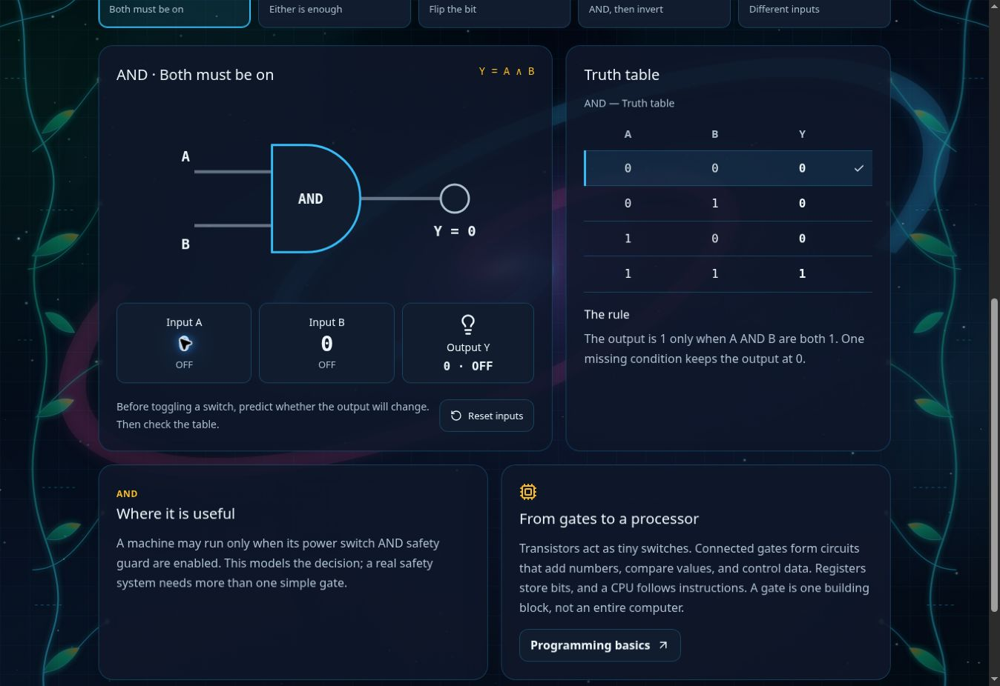

# Computer Engineering & Code

Route: `/computer-engineering`. Linked from the STEM catalog and both the Web
& App Basics and Electronics paths. The separate Khmer Lab Tech destination
remains available through the lesson footer.

## Curriculum

Five gates with canonical symbols, editable binary inputs, a live output bulb,
active truth-table row, rules, and practical applications. NOT has only one
input; OR is inclusive; XOR differs from OR at (1,1). NAND universality and
XOR/AND half-addition connect the lesson to computer engineering.

Four language guides include purpose, three code explanations, highlighted
copyable source, a next challenge, and official further reading. HTML and CSS
are correctly described as markup and style sheet languages. JavaScript and
Python are programming languages. The live controls demonstrate the supplied
examples; they do not execute arbitrary user code. Python is a labeled fixed
example walkthrough, with no downloaded Python runtime or interpreter.

Lesson text is in `data/computerEngineering.ts`; all interface copy is typed in
`locales/computerEngineering.ts`. The existing `khmerone-locale` preference is
shared with the portal, with a session fallback when storage is unavailable.
The root Kantumruy Pro font supplies Khmer rendering. UI uses existing theme
tokens; no syntax-highlighting dependency, API, or account is needed.

## Verification

`node --experimental-strip-types --test tests/*.test.mjs` checks gate outputs,
NAND inversion, half-addition, bilingual coverage, lossless highlighting, and
the supplied JavaScript click handler alongside existing repository tests.
Run `pnpm run lint`, `pnpm exec tsc --noEmit`, and `pnpm run build` as well.

Browser checks: toggle all input combinations, NOT hides B, compare the
highlighted row with the bulb, switch all four language lessons, copy code,
edit the sample heading, change its color, increment/reset the counter, and
step through Python output. Inspect 320px and 390px layouts in both languages.

Verified for this change: 16 Node tests passed, TypeScript checking passed,
the changed files passed ESLint, and the production build passed. Browser QA
covered all five gates, all four guides, code copying, the interactive examples,
and persisted Khmer mode. At 320px and 390px, the page fits its viewport and code
scrolls inside its panel. Controls have a minimum 44px touch target.

Repository-wide lint still reports three existing `set-state-in-effect` errors:
`components/TeacherToolkit.tsx` (lines 35 and 61) and
`src/components/BackgroundAudio.tsx` (line 101). Those files are unchanged by
this curriculum update. The current CI workflow stops at that lint failure.

This route does not add an offline cache or claim offline readiness. Lessons
need the initial page and assets to load; no further API requests are needed
for the interactions. Official-guide links require connectivity.

Sources: [MDN web development](https://developer.mozilla.org/en-US/docs/Learn_web_development)
and [Python control flow](https://docs.python.org/3/tutorial/controlflow.html).
